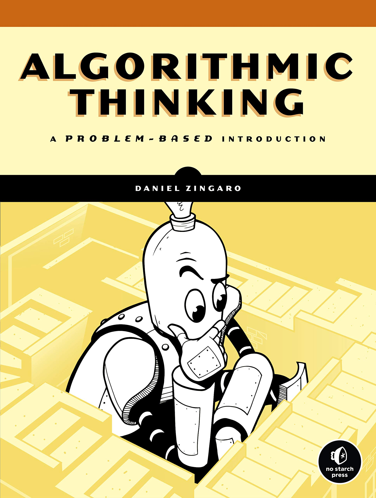

# Algorithmic Thinking: A Problem Based Introduction

This repo contains my code studies based on the book [Algorithmic Thinking: A Problem Based Introduction](https://www.amazon.com/-/pt/dp/1718500807/ref=sr_1_1?__mk_pt_BR=%C3%85M%C3%85%C5%BD%C3%95%C3%91&crid=35OM5PC6R9LMM&dchild=1&keywords=algorithmic+thinking&qid=1633468725&sprefix=algorithmic%2Caps%2C346&sr=8-1) by [Daniel Zingaro](https://www.danielzingaro.com). I also add solutions for the problems listed in his personal webpage.

# Book Description

<table border="0">
 <tr>
    <td>
        
    </td>
    <td>
        Algorithmic Thinking will teach you how to solve challenging programming problems and design your own algorithms. Daniel Zingaro, a master teacher, draws his examples from world-class programming competitions like USACO and IOI. You'll learn how to classify problems, choose data structures, and identify appropriate algorithms. You'll also learn how your choice of data structure, whether a hash table, heap, or tree, can affect runtime and speed up your algorithms; and how to adopt powerful strategies like recursion, dynamic programming, and binary search to solve challenging problems.
    </td>
 </tr>
</table>

# Exercises

The complete exercises list can be found in this [link](https://www.danielzingaro.com/alg//menu/exercises.html).
